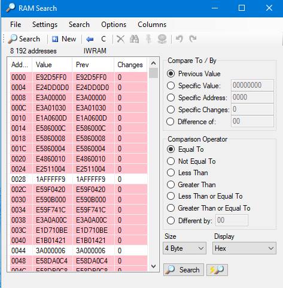
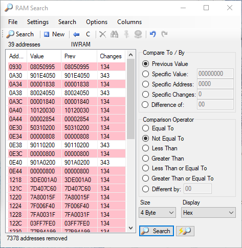
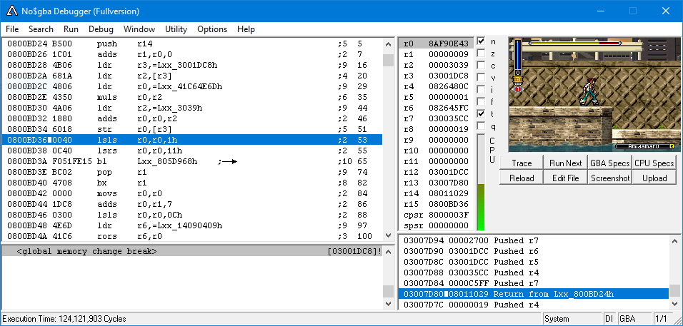

+++
title = "Reverse-engineering RNG in a GBA game"
date = 2020-01-10T11:40:29+01:00
categories = ["Reverse Engineering"]
tags = []
draft = false

summary = "Reverse-engineering a GBA game and making sense out of it. Cool animations inside!"

aliases = [
    "/article/re-skgba/re-skgba.html"
]
+++

This post is a gentle introduction to reverse-engineering, through the unusual medium of [tool-assisted speedrunning](http://tasvideos.org/WelcomeToTASVideos.html).

We're going to find an RNG (random number generator) in a game, using a combination of [dynamic and static analysis](https://reverseengineering.stackexchange.com/questions/3473/what-is-the-difference-between-static-disassembly-and-dynamic-disassembly), and then predict it later on. It also introduces usage of a debugger and disassembler, as well as some scripting.

## But why?

Tool-assisted speedrunning is beating games as fast as possible, but with infinite retries. Whenever you make a mistake, you can go back in time - literally - and try with different inputs. More sophisticated tooling allows to enter and modify the input that's passed to the game each frame. It's a meta-game; I find it kind of fun, and it makes for some cool results. TASing is about going fast: everything that makes us not fast has to be taken care of, including luck.

In video games, many events aren't random: they're given the illusion of randomness by a random number generator. Every time something in the game needs a random event, for example the generation of dust particles, or the movement of an enemy, it calls the RNG, which returns a random number. We can imagine the RNG function: it most likely returns a random number, which is then used by calling code.

If we fully understood how some RNG in a game worked and its effects on the game, we'd be able to manipulate luck itself with careful play. But how do we find out? 

## Dynamic analysis

The game I'm using here is the Gameboy Advance game ```Shaman King - Master of Spirits (U)```. I'm using the [BizHawk](https://github.com/TASVideos/BizHawk) emulator.

Well, how does the game work? After playing around for a bit to get a sense of the game, we go forward. You play a dude with a sword: he can attack with it, jump around, and do special attacks with souls he collects. That's all that we have access to.

After completing the first area, we come across an interesting enemy:

<video controls>
<source src="normal.webm" type="video/webm">
<source src="normal.mp4" type="video/mp4">
</video>

We meet a boxer enemy. He jumps back and forth, and seems to attack at a random(!) pace. After a hop, he will either jab (straight punch) or wait. We have a source of random phenomena! When running straight at him, his pattern is _Jab_, _Jab_, _Jab_, **Wait**, _Jab_ and so on. 

No matter how long we wait, this pattern is always the same. This suggests that the RNG isn't called by anyone else other than the boxer. Most of our actions don't seem to call the RNG either, like jumping, attacking or backdashing.

However, when we special attack a few times and then walk to him, the pattern changes:

<video controls>
<source src="manip.webm" type="video/webm">
<source src="manip.mp4" type="video/mp4">
</video>

The pattern is now _Jab_, _Jab_, **Wait**, _Jab_, _Jab_. We now know that special attacks do call, and thus change the RNG. But, more importantly, we have two states of the game that we can compare against: the normal state where we walk up, and the other one where we special attack and change the RNG.

Our emulator has save states, which saves the game's state. If we have two different states, we can compare between them. Let's do so with the use of RAM search, which gives us an overview of the game's entire memory. At the first search we're met with the IWRAM, which is the GBA's RAM, address space:



We can use savestates with our emulator, so let's do so. We have two states: normal and changed RNG. We load the first state, then set our comparaison to "Not Equal To" to compare against the previous values. Finally, we load the second state with changed RNG, and we get a list of what addresses have changed:



It's likely that the address of our RNG is hiding here somewhere. But what do I mean by address? Wasn't the RNG a function?

In order for RNG to function, it needs to generate a random number each time. So how would we implement it ourselves? Most likely, we would need an algorithm that generates a wide range of possible values, ideally without much repetition. But, more importantly, in order to function it may need to know the previously generated number, in order to use it as a base for the next one. Thus we can spectulate that an RNG functions as some kind of _generator_, creating a sequence of random numbers. 

To generate something new in a sequence, we need to know the last number in the sequence. It's very likely this is stored in RNG. This may not always be the case: some old video game RNGs are more primitive, relying on things like clock time for random events.

So, is our value really here? Let's check by freezing all these addresses: freezing an address means that it keeps its last value and cannot be modified. What happens?

<video controls>
<source src="freeze.webm" type="video/webm">
<source src="freeze.mp4" type="video/mp4">
</video>

The boxer now only waits - he never chooses to jab anymore. If we froze on a different RNG value, he would have likely only jabbed. We can use [binary search](https://en.wikipedia.org/wiki/Binary_search_algorithm) to find the proper address: we freeze half the addresses and keep the other ones unfrozen, and check if the behavior of the boxer is still non-random. If it is, then the address is in the frozen half: if not, the address is is the _not_-frozen half.

After a few searches, we find our address `0x1DC8` in IWRAM. It behaves as expected: the RNG is called & changes both when we do the special attack, and after boxer guy's hop, to determine if he jabs or waits.

We just did some dynamic analysis: we reasoned about how the program (the game) works as it ran, by observing it. By doing so, we were able to determine information about our program much faster than if we were disassembling the game directly. We now know the address where the RNG is located in memory, but that tells us nothing about how it actually works. All we can observe is that the RNG changes. What's the algorithm behind it? 

## Dynamic analysis

We could look at the game's binary in a disassembler. We're looking for `0x1DC8` in IWRAM, but what does that really mean?

In a GBA, memory and I/O is memory mapped, meaning that both normal memory and I/O is mapped onto fixed addresses. The GBA's address bus is 32 bits long, meaning it could address up to 4 gigabytes of address space. Most of the GBA has already been reverse engineered for us, and we can take a look at the [GBA's memory map](https://problemkaputt.de/gbatek.htm#gbamemorymap) directly. Under "General Internal Memory" we find:

```plaintext
00000000-00003FFF   BIOS - System ROM         (16 KBytes)
00004000-01FFFFFF   Not used
02000000-0203FFFF   WRAM - On-board Work RAM  (256 KBytes) 2 Wait
02040000-02FFFFFF   Not used
03000000-03007FFF   WRAM - On-chip Work RAM   (32 KBytes)
03008000-03FFFFFF   Not used
04000000-040003FE   I/O Registers
04000400-04FFFFFF   Not used
```

Starting at address `0x30000000` is our On-chip Work RAM, also known as the IWRAM segment we found earlier. Similarly, we find that ROM starts at `0x08000000`. When looking at disassembly, we would be looking for address `0x3001DC8`, as that's the memory mapped address.

Using a debugger, we can find the code that updates this address. [No$GBA](https://problemkaputt.de/gba.htm) is an emulator which includes a built-in debugger which is sufficient for our needs. We can define a breakpoint whenever the RNG is written to, in `Debug -> Toggle Breakpoint`. `[03001DC8]!` will halt execution on write. Finally, we do something in the game which advances the RNG:



We find a `str` that updates the RNG at `0x0800BD34` in the binary. `str r0, [r3]` will write the value of `r0`, which seems to contain our new RNG value `0x8AF90E43`, into an address equal to the **value** of `r3`. `r3` contains our RNG address, `0x03001DC8`, or `0x1DC8` in IWRAM. What does the code do? Let's go to a disassembler and find out. 

## Reversing RNG generation

After [setting up our disassembler, IDA, for GBA games](https://www.pokecommunity.com/showthread.php?t=235587), we look at the routine we found in more detail:

``` plaintext
ROM:0800BD24  PUSH  {LR}               ; prologue
ROM:0800BD26  MOVS  R1, R0             
ROM:0800BD28  LDR   R3, =dword_3001DC8 ; Load pointer to last RNG in R3
ROM:0800BD2A  LDR   R2, [R3]           ; Load value of RNG using the pointer
ROM:0800BD2C  LDR   R0, =0x41C64E6D    ; r2 takes 0x41C64ED
ROM:0800BD2E  MULS  R0, R2             ; r0= r0 * 0x41C64ED with integer overflow
ROM:0800BD30  LDR   R2, =0x3039        ; r2 takes 0x3039
ROM:0800BD32  ADDS  R0, R0, R2         ; r0= r0 + 0x3039
ROM:0800BD34  STR   R0, [R3]           ; Store new value of RNG at pointer
```

Here, `dword_3001DC8` is equal to `0x03001DC8`, which is `0x1DC8` [in IWRAM](https://problemkaputt.de/gbatek.htm#gbamemorymap). The `muls` will overflow the value, making the mult equivalent to a modulo 2<sup>32</sup>. So what this routine does is equivalent to:

```c
int advance_rng(int previous_rng)
{
	return ( previous_rng * 0x41C64E6D ) + 0x3039 // modulo 32 bits
}
```

This is a pretty common RNG algorithm called a [linear congruential generator](https://en.wikipedia.org/wiki/Linear_congruential_generator). 

## Emulating RNG generation: looking ahead

Phew. Let's see what we have:

* Some things (like enemies) can call the RNG.
* RNG advances every time by a known algorithm.
* We can get the current RNG value by reading off memory.

With this in place, we can predict RNG pretty easily. Why would this be useful? With knowledge of RNG, we can predict how anything in the game will act. We can map each future RNG value to an enemy behavior, like the boxer punching or not for example. For example, we could say that the boxer will punch on this RNG, then after three more calls, and so on. And knowing this, we can make our TAS runs that much faster, manipulating RNG in advance so that the right RNG hits at the right time.

However, there's one important detail: RNG can advance more than once per frame. If there are multiple enemies on-screen, then we'll have no idea what called RNG. While this is impossible to solve without disassembling every enemy's behavior, we can try something else: have our code tell us _how much_ RNG is called per frame.

To implement this I chose a dequeue, implemented with a circular buffer, which is very space efficient. The idea is that we can memoize the next RNG values, thus predicting RNG in the future. How does this particular queue work? I find it's best to try it out.

<div id="normal-buffer" class="buffer"></div>

At the start, we fill our buffer with values. Each value is generated from the previous one. Take the first generated value, when you click for the first time. The previous value is `0x0` , so `0x0 * 0x41C64E6D == 0x0`. Finally we add `0x3039`, so the resulting value is `0x0 + 0x3039 == 0x3039`. The queue lets us memoize values. If RNG advances, then insert a new value.

This acts like a normal queue. But when its capacity is full, the last value is overwritten and the head (the circle) and tail (the square) indexes change.

<div id="full-buffer" class="buffer"></div>

What if our RNG advances more than needed? Here our queue size is 8, but if RNG advances 30 times in a single frame, how do we tell? We don't have the intermediate values, we can only read from RNG frame-by-frame. In other words, we only have the starting RNG and ending RNG, and can't tell how much the RNG function was applied between the two values.

A simple way to solve this is to take the start value, apply the RNG function over and over (while storing the intermediate values) until we match the end values. The number of times we applied the RNG function is the same as the number of RNG calls. 

However, with something like an array, it would be hard to both keep a cache of values and predict next values at the same time. The answer is the queue: we can infinitely take from the queue and insert back the advanced RNG value. We keep this infinite loop going until we find our RNG. To illustrate, let's start from a full buffer, looking for value `0xE6791B2E`. Try it out: 

<div id="search-buffer" class="buffer">
	<div class="flex">
  <button class="btn" onclick=bufferLookForValue(0xe6791b2e)>Search for value</button>
  <button class="btn" onclick=resetBuffer()>Reset</button>
  </div>
</div>
<div class="results"></div>

In short, we can seek infinitely whenever RNG advances. Whenever we "consume" a value - that is, read the last RNG and insert a new RNG based on that one - increment a count by one. By reading the last few RNGs, we can have a list of what RNGs passed, even if we do not know them; we _predicted_ them using our RNG function and stepping until we find our value.

Implementing it in Lua, we can predict values in advance, and predict by how much RNG advanced when it did advance. [You can find the source here.](https://github.com/xy2iii/sk1-lua/blob/master/sk1.lua#L27)

<video controls>
<source src="rng-script.webm" type="video/webm">
<source src="rng-script.mp4" type="video/mp4">
</video>

## Conclusion

This post shows some basic reverse-engineering techniques as well as the full spectrum of tools available applied to a real problem, via tool-assisted speedrunning. It shows how far you can go in reversing a program, even with information that's sometimes very limited, using scripting to solve your problems. 

If you are interested in reverse-engineering, trying to RE games is a pretty fun way to learn without too much pressure. In the future, we might delve more into patching the game itself, as well as the object system, to implement our RNG prediction in the game itself.

<script src="d3.v5.min.js"></script>
<script src="circular.js"></script>
<script src="index.js"></script>
<style>
.buffer button {
	margin-bottom: 1rem;
}
.flex {
	display: flex;
	justify-content: center;
}
.c {
	max-width: 100%;
	height: auto;
	display: block;
	margin: 0 auto;
}
.buffer svg {
	max-width: 100%;
	height: auto;
	display: block;
	margin: 0 auto;
}
.buffer circle {
	fill: none;
	stroke: black;
	stroke-width: 2px;
}
.buffer rect {
	fill: none;
	stroke: black;
	stroke-width: 2px;
}
.cellText textPath {
	text-anchor: middle;
	font-family: Fira Code;
}
.cell {
	stroke: black;
	stroke-width: 0.3px;
}
.results {
	font-family: Fira Code;
}
@media (max-width: 600px) {
	.cellText textPath {
		font-size: 12px;
	}
}
</style>
